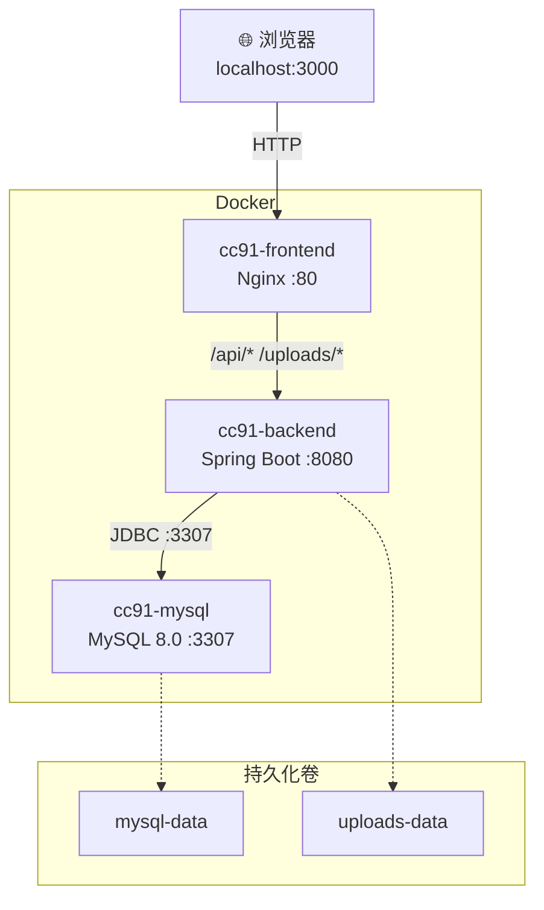

# CC91 论坛系统 — Docker 容器化部署文档

> 验收日期：2026-06-10
> 状态：✅ 通过验证，前端页面在 `http://localhost:3000` 可正常访问

---

## 1. 概述

CC91 论坛系统已完全容器化，通过 Docker Compose 编排三个服务：MySQL 数据库、Spring Boot 后端、Nginx + React 前端。一键启动即可运行完整论坛。

---

## 2. 架构



### 服务一览

| 服务 | 容器名 | 镜像 | 端口映射 |
|------|--------|------|----------|
| MySQL 8.0 | `cc91-mysql` | `mysql:8.0` | `${MYSQL_PORT}:3307` |
| Spring Boot | `cc91-backend` | 自构建 | `${BACKEND_PORT}:8080` |
| Nginx + React | `cc91-frontend` | 自构建 | `${FRONTEND_PORT}:80` |

### 容器网络

所有服务通过 `cc91-network`（bridge）互通，容器间通过容器名通信：

- 后端访问 MySQL：`mysql:3307`
- 前端代理 API：`backend:8080`

---

## 3. 涉及文件

| 文件 | 用途 |
|------|------|
| `docker-compose.yml` | 服务编排定义（MySQL + 后端 + 前端） |
| `backend/Dockerfile` | 后端多阶段构建（Maven 编译 → JRE Alpine） |
| `backend/.dockerignore` | 后端构建排除项 |
| `frontend/Dockerfile` | 前端多阶段构建（Node 编译 → Nginx Alpine） |
| `frontend/nginx.conf` | 前端 Nginx 配置（SPA 回退、API 代理、缓存） |
| `frontend/.dockerignore` | 前端构建排除项 |
| `.env` | 环境变量（数据库密码、JWT 密钥、端口映射） |
| `.env.example` | 环境变量模板（不含敏感值，可提交到版本库） |

---

## 4. 如何运行

### 4.1 前置条件

- [Docker Desktop](https://www.docker.com/products/docker-desktop/) 已安装并启动

验证：

```bash
docker --version       # >= 24.x
docker compose version  # >= 2.x
docker info            # 无报错即可
```

### 4.2 配置环境变量

项目根目录 `.env` 已包含必要配置。如果从模板创建：

```bash
cp .env.example .env
```

需修改的变量：

| 变量 | 说明 | 示例 |
|------|------|------|
| `DB_PASSWORD` | MySQL root 密码 | 你的密码 |
| `JWT_SECRET` | JWT 签名密钥（≥32 字符） | 随机字符串 |
| `MYSQL_PORT` | MySQL 宿主机端口（避免与本地 MySQL 冲突） | `3307` |
| `MAIL_USERNAME` | 邮件发送账号（可选） | — |
| `MAIL_PASSWORD` | 邮件授权码（可选） | — |

### 4.3 启动

```bash
cd D:\BigScale\program\CC91

# 构建镜像并后台启动（首次约 5-10 分钟）
docker compose up -d

# 查看运行状态
docker compose ps
```

预期输出：

```
NAME             STATUS
cc91-mysql       healthy
cc91-backend     Up (healthy)
cc91-frontend    Up
```

### 4.4 访问

浏览器打开 **http://localhost:3000** 即可访问论坛。

### 4.5 停止

```bash
# 停止所有服务
docker compose down

# 停止并删除数据卷（重置数据库和上传文件）
docker compose down -v
```

---

## 5. 常用命令

| 操作 | 命令 |
|------|------|
| 启动 | `docker compose up -d` |
| 重新构建 | `docker compose up -d --build` |
| 查看状态 | `docker compose ps` |
| 查看全部日志 | `docker compose logs` |
| 跟踪日志 | `docker compose logs -f` |
| 查看某服务日志 | `docker compose logs -f backend` |
| 停止 | `docker compose down` |
| 进入容器终端 | `docker exec -it cc91-backend sh` |
| 查看资源占用 | `docker stats` |

---

## 6. 持久化数据

| 数据卷 | 容器路径 | 内容 |
|--------|----------|------|
| `mysql-data` | `/var/lib/mysql` | 数据库文件（帖子、用户等） |
| `uploads-data` | `/app/uploads` | 用户上传的头像、附件 |

数据卷在 `docker compose down` 后保留，`docker compose down -v` 会删除。

---

## 7. 健康检查

启动顺序由健康检查保证：

1. **MySQL**：每 10s 执行 `mysqladmin ping`，最多等待 30s
2. **后端**：等 MySQL healthy 后启动，每 30s curl 端口连通性
3. **前端**：等后端启动后启动，每 30s wget 首页

---

## 8. Docker 镜像加速（国内用户）

如果拉取镜像失败，在 Docker Desktop → Settings → Docker Engine 中添加：

```json
{
  "registry-mirrors": [
        "https://docker.m.daocloud.io",
        "https://docker.1ms.run",
        "https://docker.xuanyuan.me",
        "https://dockerproxy.com"
  ]
}
```

点击 **Apply & Restart** 后重试。

---

## 9. 常见问题

### 端口冲突

错误：`bind: ... port is already allocated`

解决：编辑 `.env` 修改 `MYSQL_PORT` / `BACKEND_PORT` / `FRONTEND_PORT`，然后 `docker compose up -d`。

### 国内无法拉取镜像

错误：`dial tcp ... connectex: A connection attempt failed`

解决：按第 8 节配置镜像加速。

### Docker Desktop 未启动

错误：`The system cannot be found`

解决：打开 Docker Desktop 应用，等待托盘图标稳定。

---

## 10. 验收结论

- [x] MySQL 容器正常启动并通过健康检查
- [x] Spring Boot 后端正常启动，Flyway 自动执行数据库迁移
- [x] Nginx + React 前端正常启动，页面可访问
- [x] 浏览器访问 `http://localhost:3000` 展示论坛首页
- [x] API 代理正常工作（前端 → 后端）

> **验收通过。** CC91 论坛系统已完整容器化，支持一键部署。
